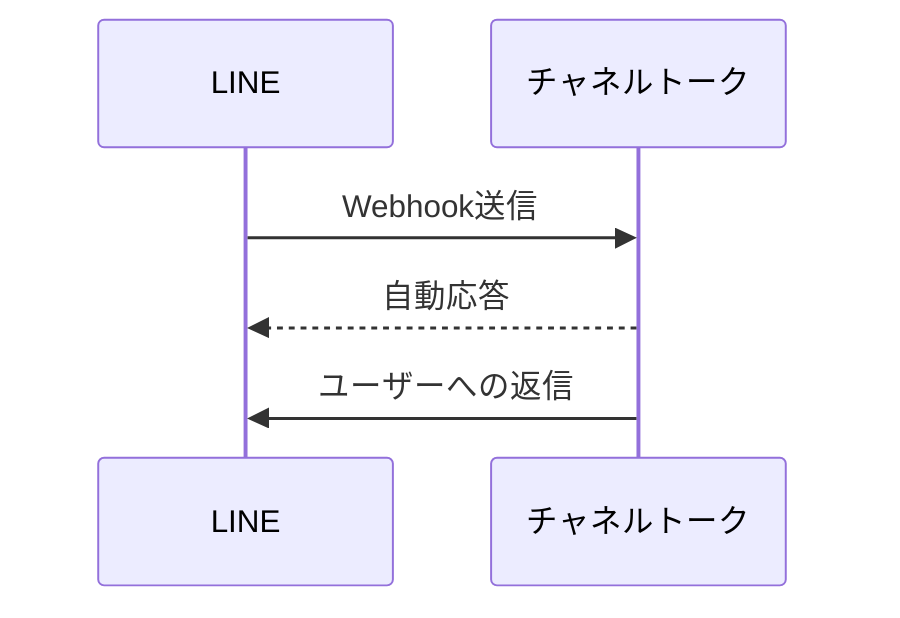
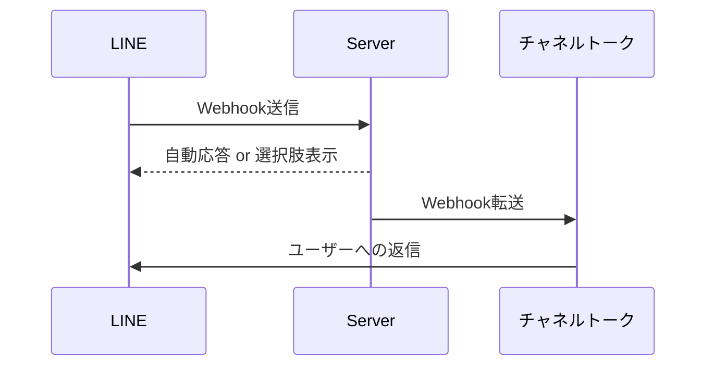

この記事はMOSH Advent Calendar 2024の1日目の記事です。
https://adventar.org/calendars/9989

LINEの問い合わせ対応の窓口の一次対応ボットをHonoで実装したのでその話をします。

## お問い合わせ基盤について

MOSHでは[チャネルトーク](https://channel.io/ja)という顧客管理及びチャットサポートのサービスを利用しており、ユーザーとのやりとりはチャネルトーク経由で対応しています。

今回紹介するLINEの対応についてもチャネルトークの外部連携機能を使ってLINEに届いたメッセージをチャネルトーク内の受信ボックスに転送しています。
https://docs.channel.io/help/ja/categories/7693abeb-%E5%A4%96%E9%83%A8%E3%82%B5%E3%83%BC%E3%83%93%E3%82%B9%E9%80%A3%E6%90%BA

### 今回やりたいこと

今回はLINEからチャネルトークに接続している部分にWebhookを受信するアプリケーションを挟み、そこで独自の処理を入れます。

処理自体はシンプルで、特定のワードに対して適切な選択肢を返してあげる(対応する選択肢がなければ自動応答メッセージを送信)という機能を実装するだけです。

**Before**



**After**



## プラットフォーム側の設定

### Cloudflare

[line/bot-sdk](https://www.npmjs.com/package/@line/bot-sdk)を使用する場合は内部でNode.jsのAPIを呼び出しているのでcompatibility_flagsで `nodejs_compat` を指定する必要があります。
https://developers.cloudflare.com/workers/runtime-apis/nodejs/

```toml:wrangler.toml
name = "linebot"
compatibility_date = "2024-08-29"
compatibility_flags = ["nodejs_compat"]
pages_build_output_dir = "./dist"
```

### LINE Webhook

LINEのコンソールから今回実装するアプリケーションのWebhook受信用のURLを設定します。

LINE側は1つの送信先しか設定できないという仕様なので、そのままWebhookの送信先を変更するだけではチャネルトークにLINEのメッセージが記録されなくなってしまいます。
そのため今回は自動応答の実装に加えてチャネルトークへWebhookの内容を転送する処理も実装しました。

## アプリケーションの作成〜実装

Honoのドキュメント通りですが `create-hono` コマンドを実行してプラットフォームからcloudflare-pagesを選択します。(workers向けもあるので使いたい方を選択)
https://hono.dev/docs/getting-started/cloudflare-pages

```bash
bunx create-hono linebot
create-hono version 0.14.3
✔ Using target directory … linebot
? Which template do you want to use?
  aws-lambda
  bun
❯ cloudflare-pages
  cloudflare-workers
  deno
  fastly
  lambda-edge
(Use arrow keys to reveal more choices)
```

### 署名の検証

LINEから送信されるWebhookには署名が付与されており、検証しなければなりません。
https://developers.line.biz/ja/docs/messaging-api/receiving-messages/#verify-signature

```typescript
const signature = c.req.header("x-line-signature");
const body = await c.req.text();
const envVars = env(c);
if (
  !signature ||
  !validateSignature(body, envVars.LINE_CHANNEL_SECRET, signature)
) {
  // エラー処理、処理の中断
}

// 本処理の実行
```

### 選択肢を表示する処理

LINEのクイックリプライという機能を使います。
メッセージ画面に横スクロールの選択肢を表示してそれをタップすると設定したメッセージが送信されるという仕組みです。
https://developers.line.biz/ja/docs/messaging-api/using-quick-reply/

通常のフリーテキストの問い合わせと区別をするために送ってもらうメッセージには `>` を接頭辞として設定しています。

```typescript
client.replyMessage({
  replyToken: event.replyToken,
  messages: [{
    type: "text",
    text: "今日食べたいものを選んでください",
    quickReply: {
      items: [
        {
          type: "action",
          action: { type: "message", label: "🍣", text: ">寿司" },
        },
        {
          type: "action",
          action: { type: "message", label: "🍛", text: ">カレー" },
        },
        {
          type: "action",
          action: { type: "message", label: "🍜", text: ">ラーメン" },
        }
      ]
    }
  }]
});
```

### チャネルトークへの転送

```typescript
fetch(envVars.CHANNEL_TALK_WEBHOOK_URL, {
  method: "POST",
  headers: {
    "Content-Type": "application/json; charset=utf-8",
    "x-line-signature": signature,
  },
  body,
});
```

### コード全体

上述した処理やバリデーション、その他必要な処理などを組み合わせると以下のようになりました。

```typescript
import {
  type WebhookEvent,
  messagingApi,
  validateSignature,
} from "@line/bot-sdk";
import { Hono } from "hono";
import { env } from "hono/adapter";
import { HTTPException } from "hono/http-exception";

type Bindings = {
  LINE_CHANNEL_ACCESS_TOKEN: string;
  LINE_CHANNEL_SECRET: string;
  CHANNEL_TALK_WEBHOOK_URL: string;
};

const app = new Hono<{ Bindings: Bindings }>();

// ヘルスチェック用
app.get("/", (c) => {
  return c.text("OK");
});

app.post("/webhook/line", async (c) => {
  // 署名の検証
  const signature = c.req.header("x-line-signature");
  const body = await c.req.text();
  const envVars = env(c);
  if (
    !signature ||
    !validateSignature(body, envVars.LINE_CHANNEL_SECRET, signature)
  ) {
    throw new HTTPException(401, { message: "Unauthorized" });
  }

  // ChannelTalkへWebhookを転送
  await fetch(envVars.CHANNEL_TALK_WEBHOOK_URL, {
    method: "POST",
    headers: {
      "Content-Type": "application/json; charset=utf-8",
      "x-line-signature": signature,
    },
    body,
  });

  const payload = await c.req.json<{ events: WebhookEvent[] }>();
  const events = payload.events.filter((event) => {
    // 今回の処理で対象となるテキストメッセージ以外は除外
    if (event.type !== "message" || event.message.type !== "text") {
      return false;
    }

    // 対象ワードに該当しないものは除外
    if (!["ご飯", "メシ"].includes(event.message.text)) {
      return false;
    }

    return true;
  });

  const client = new messagingApi.MessagingApiClient({
    channelAccessToken: envVars.LINE_CHANNEL_ACCESS_TOKEN,
  });
  const promises = events.map((event) =>
    client.replyMessage({
      replyToken: event.replyToken,
      messages: [{
        type: "text",
        text: "今日食べたいものを選んでください",
        quickReply: {
          items: [
            {
              type: "action",
              action: { type: "message", label: "🍛", text: ">カレー" },
            },
            {
              type: "action",
              action: { type: "message", label: "🍣", text: ">寿司" },
            },
            {
              type: "action",
              action: { type: "message", label: "🍜", text: ">ラーメン" },
            }
          ]
        }
      }]
    });
  );

  await Promise.allSettled(promises);

  return c.text("OK");
});

export default app;
```

## まとめ

Honoはシンプルながらも様々なプラットフォーム上での動作を想定されている作りで、セットアップに時間がかからず実装に集中できる体験が非常に良かったです。

Cloudflareに関してもポジトリ連携による自動デプロイや他社サービスとのインテグレーションが用意されており、開発者に優しいホスティングサービスでした。
